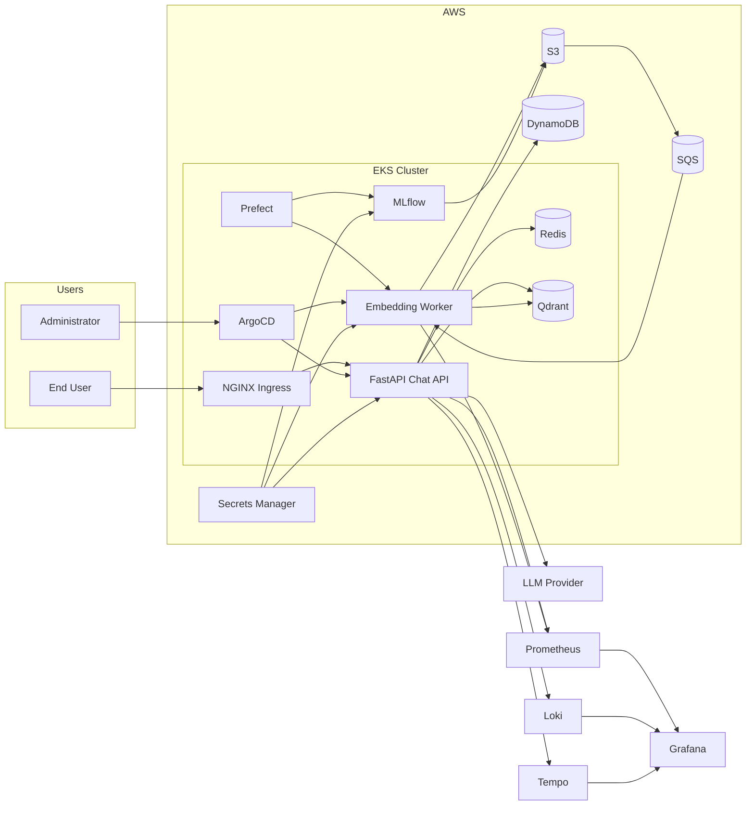

# C4 Model - Level 2
# Container Diagram

## Purpose

This diagram illustrates the major containers (applications, databases, external systems) that make up the OrderlyOps platform and the relationships between them.

