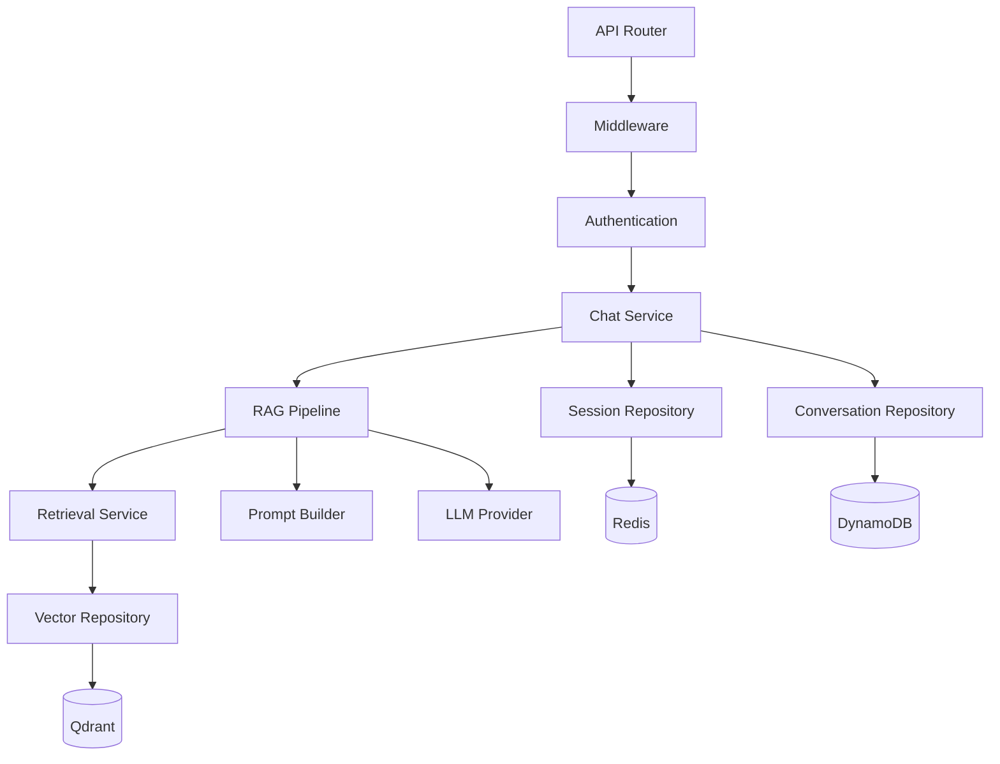

# C4 Model - Level 3
# FastAPI Component Diagram

## Purpose

This diagram describes the internal architecture of the FastAPI application.

```mermaid
flowchart TB

Router[API Router]

Middleware[Middleware]

Auth[Authentication]

ChatService[Chat Service]

RAG[RAG Pipeline]

Retrieval[Retrieval Service]

Prompt[Prompt Builder]

LLM[LLM Provider]

SessionRepo[Session Repository]

ConversationRepo[Conversation Repository]

VectorRepo[Vector Repository]

Redis[(Redis)]

Dynamo[(DynamoDB)]

Qdrant[(Qdrant)]

Router --> Middleware

Middleware --> Auth

Auth --> ChatService

ChatService --> SessionRepo

ChatService --> RAG

ChatService --> ConversationRepo

RAG --> Retrieval

RAG --> Prompt

RAG --> LLM

Retrieval --> VectorRepo

SessionRepo --> Redis

ConversationRepo --> Dynamo

VectorRepo --> Qdrant
```
