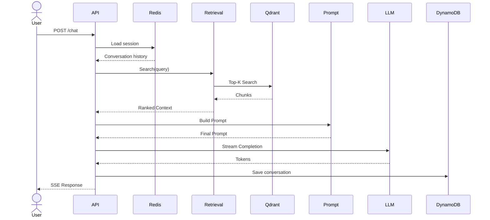

# Sequence Diagram
# Chat Request

```mermaid
sequenceDiagram

actor User

participant API
participant Redis
participant Retrieval
participant Qdrant
participant Prompt
participant LLM
participant DynamoDB

User->>API: POST /chat

API->>Redis: Load session

Redis-->>API: Conversation history

API->>Retrieval: Search(query)

Retrieval->>Qdrant: Top-K Search

Qdrant-->>Retrieval: Chunks

Retrieval-->>API: Ranked Context

API->>Prompt: Build Prompt

Prompt-->>API: Final Prompt

API->>LLM: Stream Completion

LLM-->>API: Tokens

API->>DynamoDB: Save conversation

API-->>User: SSE Response
```
