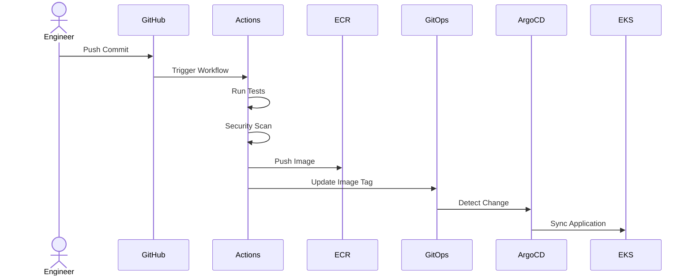

# Sequence Diagram
# Deployment Pipeline

```mermaid
sequenceDiagram

actor Engineer

participant GitHub

participant Actions

participant ECR

participant GitOps

participant ArgoCD

participant EKS

Engineer->>GitHub: Push Commit

GitHub->>Actions: Trigger Workflow

Actions->>Actions: Run Tests

Actions->>Actions: Security Scan

Actions->>ECR: Push Image

Actions->>GitOps: Update Image Tag

GitOps->>ArgoCD: Detect Change

ArgoCD->>EKS: Sync Application
```
