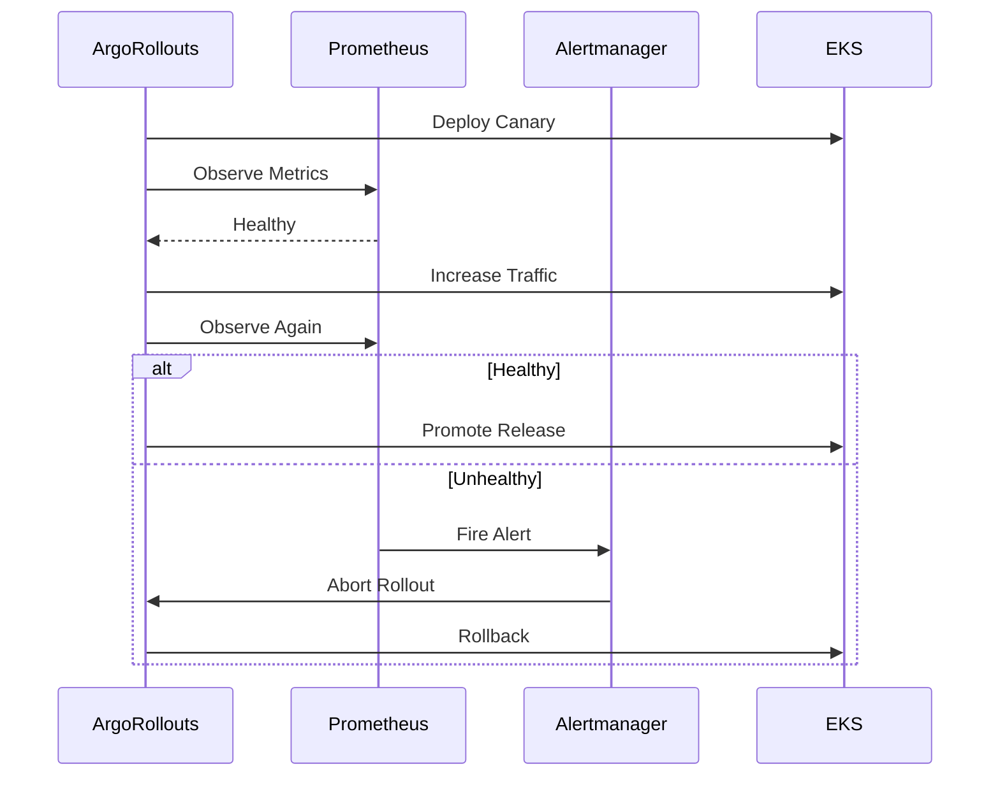

# Sequence Diagram
# Progressive Deployment

```mermaid
sequenceDiagram

participant ArgoRollouts

participant Prometheus

participant Alertmanager

participant EKS

ArgoRollouts->>EKS: Deploy Canary

ArgoRollouts->>Prometheus: Observe Metrics

Prometheus-->>ArgoRollouts: Healthy

ArgoRollouts->>EKS: Increase Traffic

ArgoRollouts->>Prometheus: Observe Again

alt Healthy
    ArgoRollouts->>EKS: Promote Release
else Unhealthy
    Prometheus->>Alertmanager: Fire Alert
    Alertmanager->>ArgoRollouts: Abort Rollout
    ArgoRollouts->>EKS: Rollback
end
```
