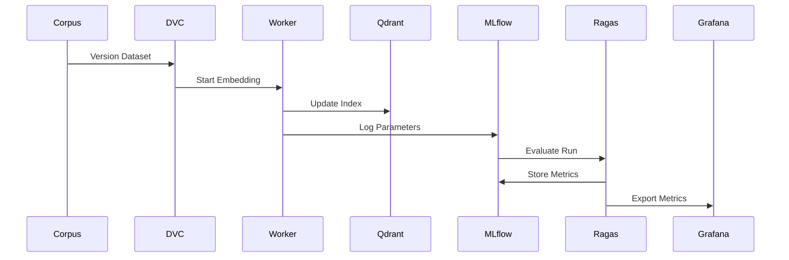

# Sequence Diagram
# ML Lifecycle

```mermaid
sequenceDiagram

participant Corpus

participant DVC

participant Worker

participant Qdrant

participant MLflow

participant Ragas

participant Grafana

Corpus->>DVC: Version Dataset

DVC->>Worker: Start Embedding

Worker->>Qdrant: Update Index

Worker->>MLflow: Log Parameters

MLflow->>Ragas: Evaluate Run

Ragas->>MLflow: Store Metrics

Ragas->>Grafana: Export Metrics
```
