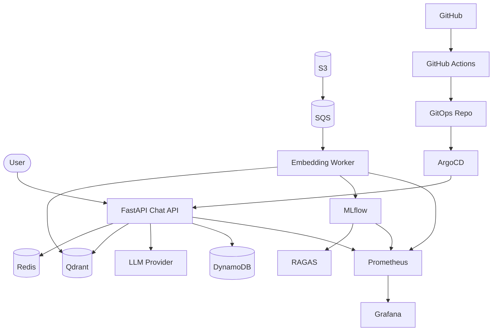

# System Workflow

```mermaid
flowchart TB

User([User])

API[FastAPI Chat API]

Redis[(Redis)]

Qdrant[(Qdrant)]

LLM[LLM Provider]

Dynamo[(DynamoDB)]

S3[(S3)]

SQS[(SQS)]

Worker[Embedding Worker]

MLflow[MLflow]

Ragas[RAGAS]

GitHub[GitHub]

Actions[GitHub Actions]

GitOps[GitOps Repo]

ArgoCD[ArgoCD]

Grafana[Grafana]

Prometheus[Prometheus]

User --> API

API --> Redis

API --> Qdrant

API --> LLM

API --> Dynamo

S3 --> SQS

SQS --> Worker

Worker --> Qdrant

Worker --> MLflow

MLflow --> Ragas

GitHub --> Actions

Actions --> GitOps

GitOps --> ArgoCD

ArgoCD --> API

Prometheus --> Grafana

API --> Prometheus

Worker --> Prometheus

MLflow --> Prometheus
```
