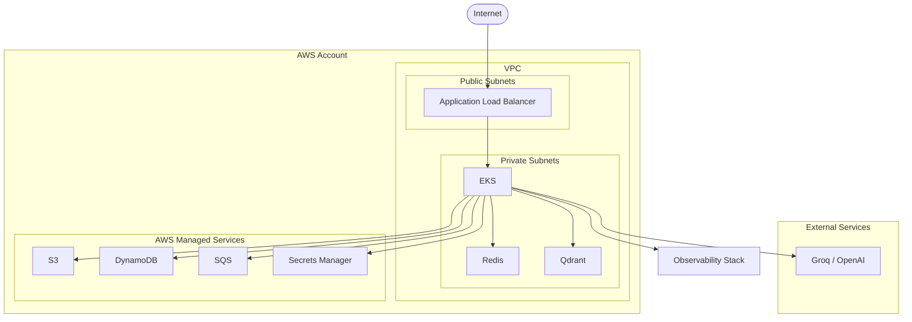

```mermaid
graph TD
    Internet([Internet])

    subgraph AWS["AWS Account"]
        subgraph VPC["VPC"]
            subgraph Public["Public Subnets"]
                ALB[Application Load Balancer]
            end

            subgraph Private["Private Subnets"]
                EKS[EKS]
                Redis[Redis]
                Qdrant[Qdrant]
            end
        end

        subgraph Managed["AWS Managed Services"]
            S3[S3]
            DynamoDB[DynamoDB]
            SQS[SQS]
            Secrets[Secrets Manager]
        end
    end

    subgraph External["External Services"]
        LLM[Groq / OpenAI]
    end

    Observability[Observability Stack]

    Internet --> ALB
    ALB --> EKS
    EKS --> Redis
    EKS --> Qdrant
    EKS --> S3
    EKS --> DynamoDB
    EKS --> SQS
    EKS --> Secrets
    EKS --> LLM
    EKS --> Observability
```